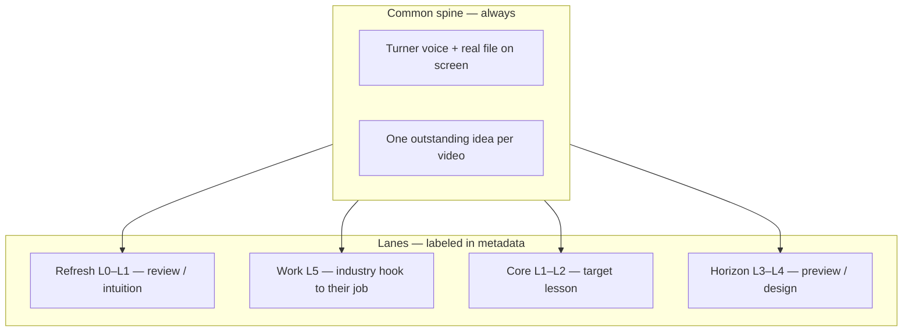
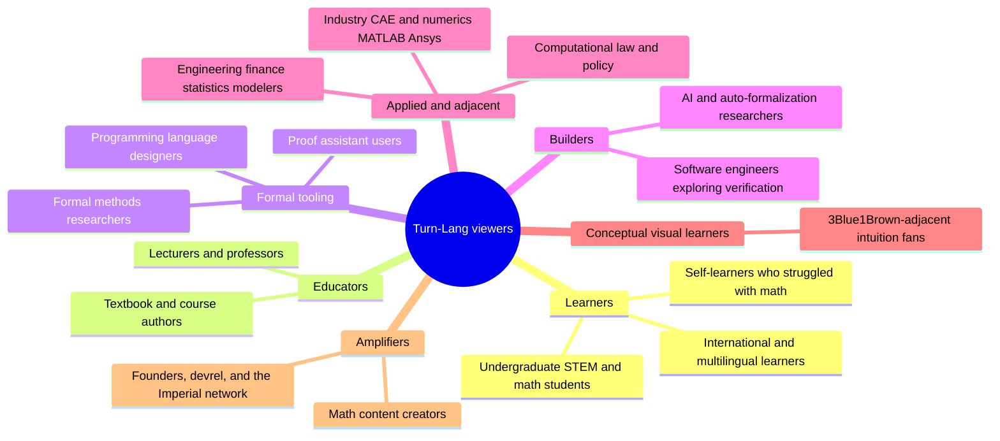
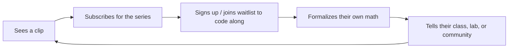

# Turn-Lang Audience Analysis

Who is likely to watch the videos, subscribe to Turn-Lang, and help spread it. Drawn from the published videos, the idea scripts in `script/`, and `../benefit_of_turn-lang_for_customer.md`.

The goal of this file: pick the right audience for each video, speak in a tone that lands, and know what turns a viewer into a subscriber and then into an evangelist.

## Education bands and patience (one viewer, three lanes)

We do **not** sort viewers into fixed IQ buckets. We sort **content** by **education stage** and **patience budget**, while assuming **one person moves across bands** — an undergraduate should feel at home in a long algebra video _and_ benefit from a high-school-flavoured refresh clip _and_ a graduate-flavoured horizon clip without feeling whiplash.

### Bands (education stage, not “smartness”)

| Band                  | Typical viewer                                                                          | What they need from us                                                               | Patience (typical) |
| --------------------- | --------------------------------------------------------------------------------------- | ------------------------------------------------------------------------------------ | ------------------ |
| **L0 — curious**      | HS or self-learner; “math can be formalized?”                                           | Metaphor, one screen, no jargon pile-up                                              | 30–90 s clips      |
| **L1 — course**       | Undergrad in first proof course                                                         | Definitions tied to homework; quantifier order; “why this step”                      | 3–15 min           |
| **L2 — major**        | Undergrad math major / repeat course                                                    | Full definitions, outline navigation, named obligations                              | 15–45 min          |
| **L3 — graduate**     | MSc / early PhD                                                                         | Structure design, consistency, exists-as-claim, proof obligations                    | 5–25 min focused   |
| **L4 — practitioner** | Professor, Lean user, FM researcher                                                     | Comparisons, design trade-offs, inspectable artifacts                                | 5–20 min technical |
| **L5 — industry**     | Elite CAE / numerics / simulation engineer (MATLAB, Mathcad, Abaqus, LS-DYNA, Ansys, …) | Math review **only if tied to their model**; sense-making for tools they already run | 3–12 min; clips OK |

Patience is **orthogonal** to band: a tired L2 student may only watch L0-length clips; an L4 professor may binge a 45-minute formalization. An **L5** lead may watch a 40 s “well-defined map” clip because it explains a user-subroutine boundary condition. Label **both** on each script.

### Three lanes on every video (common spine, different depth)

Same person at **L1** should experience three layers without distraction:



| Lane        | Role for the viewer                               | How it feels                         | Example from 1.2 long video                                                                                              |
| ----------- | ------------------------------------------------- | ------------------------------------ | ------------------------------------------------------------------------------------------------------------------------ |
| **Refresh** | “I knew this once” — fast confidence              | Optional 10–20 s beat; metaphor      | Bag of pairs; cutting-the-cake partition                                                                                 |
| **Work**    | “This is why my solver cares” — **L5 only**       | 15–30 s bridge to FEA/numerics/tools | Well-defined = single-valued constitutive map; partition = domain decomposition intuition                                |
| **Core**    | “This is tonight’s homework / formalization step” | Main runtime                         | `well_defined`, surjective order, `Composition`                                                                          |
| **Horizon** | “This is where the subject goes”                  | 30–90 s teaser; no full proof        | `exists InverseFunction` as claim; partition container `where`; **roadmap:** applied math, algorithms, numerics, systems |

**Anti-distraction rules**

1. **Label the lane in metadata** (`Education core:`, `Education refresh:`, `Education horizon:`) so editors and LLMs know intent; optional on-screen chip later (“Review” / “Core” / “Preview”).
2. **Never mix lanes in one sentence** — refresh metaphor first, then core syntax, then horizon tease as separate beats.
3. **Horizon is a promise, not a detour** — “I’ll prove this in the pitfalls series” not a 5-minute proof.
4. **Refresh is permission, not condescension** — “Think of a bag of ordered pairs” lets an L2 student nod and an L0 viewer catch up; same line serves both.
5. **One file, many depths** — the `.turn` file is the common object; L0 sees rendered math, L2 sees laws, L3 sees obligation names.
6. **Work lane is optional** — use only when `Primary audience` or `Education core` includes L5; never force FEA jargon into a pure algebra homework clip.

### Script header fields (add to each `script/*.md`)

```md
Education core: L1–L2
Education refresh: L0 (bag-of-pairs metaphor)
Education work: L5 (well-defined ↔ single-valued material map — optional)
Education horizon: L3 (exists on structures — tease pitfalls playlist)
Patience: medium (8 min clip) | long (25 min lecture)
Primary audience: Undergraduate STEM and math students
Work link: none | FEA domain split | constitutive tangent | solver pipeline
```

- **Primary audience** = who we optimize pacing for (existing field).
- **Education core** = who must follow without feeling lost.
- **Education refresh** = optional lower band served (omit if none).
- **Education work** = optional L5 industry bridge (omit if none).
- **Education horizon** = optional upper band teased (omit if none).
- **Work link** = one-line note for LLM: how this concept maps to MATLAB/Mathcad/CAE practice.
- **Patience** = expected sit-still time.

### Playlist × band (default centre of gravity)

| Playlist                      | Core band | Refresh band | Horizon band |
| ----------------------------- | --------- | ------------ | ------------ |
| why we need turn-lang         | L0–L1     | L0           | L2–L3        |
| turn-lang syntax highlight    | L1–L2     | L0–L1        | L3           |
| pitfalls of formal method     | L0–L1     | L0 (universal FM pain) | L3–L4 (design compare) |
| abstract algebra from scratch | L1–L2     | L0–L1        | L2–L3        |

Future playlists (roadmap): **applied math · numerics · algorithms · systems** — centre **L5** core, **L1** refresh, **L3** horizon on correctness of discrete models.

Long series episodes (e.g. 1.2 functions) are **Core L1–L2** with **Refresh** beats baked in and **Horizon** beats at exists/partition — not separate audiences. **Work** lane can be a single sentence in description or a dedicated short for L5.

### Same undergraduate, two clips same week

| Clip                         | Core  | Refresh                  | Horizon             | Why it’s not distracting                                  |
| ---------------------------- | ----- | ------------------------ | ------------------- | --------------------------------------------------------- |
| Well-defined f(p/q) short    | L1    | L0 one-input-two-outputs | —                   | Single punchline; no grad machinery                       |
| exists InverseFunction short | L2    | —                        | L3–L4 axiom→theorem | Title says “pitfalls”; undergrad can skip or save         |
| Full 1.2 lecture             | L1–L2 | metaphors throughout     | 1.25 + exists tease | Lanes are **sequenced** in time, not interleaved randomly |

### Commonality (what stays constant across bands)

- Turner voice (`voice_profile.md`).
- Real repo file on screen — never a fake snippet.
- One outstanding idea per short; one chapter chunk per long.
- Modest claims; empathy beat where it fits.
- `Builds on:` chain so any band can step back one video.

### LLM / Video Ops usage

When drafting scripts: set education fields first, then `Say:` lines. When cutting clips from `published/…` **Clip candidates**: assign each clip a **core band** and lane (refresh/core/horizon). Prefer clips that are **single-lane** for TikTok; use **multi-lane** only in long form.

### Short script intuition ladder

Every short needs enough background that a cold viewer can pick it up without having watched 1.2.

| Beat | Job | Typical lines |
| ---- | --- | ------------- |
| **Familiar object** | Put a concrete picture in the viewer's head | "Imagine a table of allowed pairs", "Think of sorting people into bins" |
| **Question** | Name the confusion the clip resolves | "What makes this a function?", "What does 'form' mean?" |
| **Turn reveal** | Show one inspectable Turn feature | refinement line, named law, `witness confirm`, theorem leaf |
| **Math receipt** | Read the exact `.turn` snippet after the idea lands | 1-2 lines, not a proof lecture |

The first 15 seconds should feel like **3Blue1Brown with the repo open**: metaphor, question, then source file. Avoid cold starts like "In our AATA file..." unless the previous sentence already gave the mental picture.

**User-facing filter:** if the hook only makes sense to someone who works on Turn's repo (agent quiz, export JSON, daily corpus), rewrite it. The viewer is a student, self-learner, or instructor — not a labeling contractor.

### Pitfalls shorts — experience → Turn wedge → math (in that order)

**Do not** open pitfalls shorts on a definition block. The viewer should feel a **formal-methods moment they already lived** before any Judson symbol.

| Beat | Job | Time (short) | Example hook |
| ---- | --- | ------------ | ------------ |
| **1. Experience** | Name the trap in plain language — homework, Lean/Coq, MC quiz, "proof looked done" | 10–25 s | "You swapped forall and exists in your head; the checker never complained until week 8." |
| **2. Turn wedge** | One thing **only Turn shows** on screen — not a feature list | 15–35 s | Adjective laws visible in source; `witness … for x in h` unpacks a receipt; option Z rejects a bad stem; `#!` keeps failed arms |
| **3. Math (optional)** | Clean definition **after** the trap is named | 10–20 s | Show the real `.turn` line as confirmation, not as the cold open |

**Turn wedges that grab attention** (pick one per short):

- Source is the referee — properties/laws/adjectives readable without tactic archaeology
- Named `confirm { … }` obligations — side conditions keep human names
- Trial branches `#!` — failed attempts stay beside the step they tried
- Reject the premise — daily quiz option Z / `is_bad_question`
- `exists` on a structure is a **claim**, not a silent axiom
- Proof-slide replay — goal changes every tactic, not a final QED line
- Witness unpack vs invent — diagnostics refuse invented binders

**Playlist split (important):**

| Content | Belongs in |
| ------- | ---------- |
| 1.2 timestamp re-cuts that teach `Function.surjective` shape | **algebra** or **syntax** playlist |
| Universal FM pain + Turn differentiator | **pitfalls** playlist |
| Parser/proof-engine deep dives (`video idea todo.md`) | **pitfalls** long-form (8–15 min), same 3-beat open |

Current gap: `pitfalls-01`, `04`, `05` in `CLIPS-FROM-1.2-README.md` were cut from the algebra lecture — **math-first**. Reframe or re-home before filming as pitfalls. `pitfalls-02`, `03` are closer; `pitfalls-03` is already experience-first.

Script header (add for pitfalls shorts):

```md
Hook type: experience | turn-wedge | math-confirm
Turn wedge: named confirm | visible trials | reject premise | source referee | …
Compare: Lean silent goals | MC forced choice | textbook prose | none
```

## The picture



## The four playlists and who they serve

- **why we need turn-lang** — motivation and positioning. Widest reach. For people deciding whether formalized math is worth their attention.
- **turn-lang syntax highlight** — the workspace and the syntax. For people who like seeing the tool actually work.
- **pitfalls of formal method** — **formal-method experience first**, then the Turn wedge, then math only as proof. Shorts sell what other tools hide (named obligations, visible trials, reject-bad-question, source-as-referee) — not algebra definitions repackaged. For students, proof-assistant users, and engineers who want "I never noticed that" before the symbols.
- **abstract algebra: formalized from scratch with turn-lang** — the long-running series. For committed learners who will follow a textbook end to end.

## Audience classes

### 1. Self-learners who struggled with math

- **Profile:** smart, curious adults and students who felt locked out of pure math by how it was taught.
- **Pain / desire:** "I was told I'm not a math person." They want rigor without gatekeeping.
- **Hooks:** the empathy beat — "this is not your fault, it's how the material is presented." First-principles framing.
- **Playlists:** why we need turn-lang; abstract algebra from scratch.
- **Converts when:** they feel they can finally follow a real proof. CTA: sign up to code along.
- **Spreads by:** emotional word of mouth, sharing "this finally made it click."
- **Tone dial:** warm, encouraging, personal. Most "you" and "we".

### 2. Undergraduate STEM and math students

- **Profile:** people mid-degree using the videos as a companion to courses and homework.
- **Pain / desire:** proofs feel like guessing; they want to know which step is justified.
- **Hooks:** side conditions you can name, named goals, the outline tree, the from-scratch series.
- **Playlists:** all four, especially abstract algebra from scratch and pitfalls.
- **Converts when:** a video resolves a confusion from their actual class. CTA: free month, code along.
- **Spreads by:** sharing in course group chats and subreddits near exam season.
- **Tone dial:** friendly and concrete; show the workspace.

### 3. Lecturers, professors, and course authors

- **Profile:** people who teach, including the "Terence Tao reading your description" archetype.
- **Pain / desire:** want rigorous, teachable presentations and tools students will actually use.
- **Hooks:** modest, precise claims; the textbook-from-scratch method; multi-claim theorems as documents.
- **Playlists:** why we need turn-lang; abstract algebra from scratch.
- **Converts when:** they trust the claims are not hype and could adopt it for teaching.
- **Spreads by:** recommending to whole cohorts; high-credibility endorsement.
- **Tone dial:** scholarly and calm; keep the warmth but drop slogans.

### 4. Proof assistant users (Lean, Coq, Isabelle)

- **Profile:** already formalize math; evaluating whether Turn-Lang offers something better.
- **Pain / desire:** proof states explode invisibly; modeling propositions is awkward.
- **Hooks:** fair, specific comparisons — object vs relation, `where` bundling, existentials in the context, named `confirm` obligations.
- **Playlists:** why we need turn-lang; turn-lang syntax highlight; pitfalls.
- **Converts when:** a concrete modeling win is undeniable. CTA: try it, join the waitlist.
- **Spreads by:** debating and benchmarking publicly; technical credibility.
- **Tone dial:** technical and precise; never bash, always show the specific difference.

### 5. Formal methods researchers and PL designers

- **Profile:** care about parser behavior, LSP, recovery, soundness, language design discipline.
- **Pain / desire:** want the design choices and trade-offs, not marketing.
- **Hooks:** outline tree from the language server, syntax design (bracket meanings, witness binders), recovery.
- **Playlists:** turn-lang syntax highlight; pitfalls.
- **Converts when:** the architecture looks principled and inspectable.
- **Spreads by:** citing, blogging, contributing; long-tail authority.
- **Tone dial:** deep and exact; assume fluency.

### 6. Software engineers exploring verification and AI reasoning

- **Profile:** programmers intrigued by verifiable reasoning and "what's after LLM chat."
- **Pain / desire:** want trustworthy, inspectable outputs, not vibes.
- **Hooks:** the source is the math; the checker reacts on the exact line; verifier as resistant reality.
- **Playlists:** why we need turn-lang; turn-lang syntax highlight.
- **Converts when:** they see a clean local feedback loop.
- **Spreads by:** sharing on engineering social; star/try the tool.
- **Tone dial:** crisp, demo-first, slightly informal.

### 7. AI and auto-formalization researchers

- **Profile:** people working on verifiable reasoning, RLVR, agentic math.
- **Pain / desire:** want replayable, checkable artifacts instead of opaque model output.
- **Hooks:** formalization as a reviewable artifact; verifier feedback; "AI should not surprise-edit your proof."
- **Playlists:** why we need turn-lang.
- **Converts when:** they see Turn as infrastructure for trustworthy AI math.
- **Spreads by:** research circles, talks, collaborations.
- **Tone dial:** technical, forward-looking, careful claims.

### 8. Applied and interdisciplinary modelers

- **Profile:** computational law, engineering, finance, statistics; people who model real systems.
- **Pain / desire:** textbook side conditions get lost; they want explicit, checkable assumptions.
- **Hooks:** named obligations; constraints as a bundle; computational law framing.
- **Playlists:** why we need turn-lang; pitfalls.
- **Converts when:** they map a real domain rule onto a named obligation.
- **Spreads by:** bringing it into their field's tooling discussions.
- **Tone dial:** practical, example-driven.

### 9. Industry CAE, numerics, and scientific-computing leads (L5)

- **Profile:** graduated engineers and applied scientists who are **elite in their industry** — running MATLAB, Mathcad, Python/NumPy, Julia, or solvers (Abaqus, LS-DYNA, Ansys, COMSOL, etc.). Often years past coursework; sharp but rusty on pure definitions.
- **Pain / desire:** black-box solvers and legacy scripts; want **sense-making** without going back to undergrad full-time. Math review is attractive **only when it explains a model they ship** (BCs, tangents, stability, domain decomposition, unit consistency).
- **Hooks:** well-defined maps = single-valued material response; composition = operator pipeline; partition = mesh/block intuition; Turn roadmap — **applied math, algorithms, numerical computing, systems programming** with the same checker as the textbook.
- **Playlists:** why we need turn-lang (positioning); future applied/numerics series; **short clips** with **Work** lane from algebra/pitfalls library.
- **Converts when:** one concept from a long proof video maps cleanly to their daily file (input deck, UMAT, convergence log). CTA: “comment your solver / your next constitutive law.”
- **Spreads by:** LinkedIn engineering circles, simulation Discord, internal tooling champions.
- **Tone dial:** respect their experience; **no undergrad condescension**; open with the **job problem**, then 20 s refresh, then Turn on screen. Patience is medium — they will not sit through 25 min of Judson unless the title promises CAE payoff.
- **Band:** **L5 industry**; use `Work link:` in script metadata.

### 10. Visual conceptual learners (3Blue1Brown-adjacent)

- **Profile:** people who **understand by picture and story** — heavy overlap with Turn’s best fans. They love Manim-style intuition; Turn does **not** compete on animation yet.
- **Pain / desire:** proof assistants feel like symbols without geometry; textbooks skip the “why this object exists.”
- **What Turn offers instead:** **concept graph on paper** — inheritance, `where` blocks, outline tree, named laws linking structures. Connections between ideas are **navigable**, not buried in prose.
- **Hooks:** “follow the arrow in the outline”; one metaphor then the real definition; show how two structures **relate** (Function refines Relation) like a diagram edge.
- **Playlists:** all four; especially syntax (structure graph) and pitfalls (one “aha”).
- **Converts when:** they see the **document** as the picture — click from `Partition` to `EquivalenceClass` to theorem leaves.
- **Spreads by:** sharing clips that have a strong mental image (pipeline, cake partition, bag of pairs).
- **Tone dial:** borrow **3Blue1Brown narrative discipline** (see below) but **Turner stays primary** — workspace and file, not voiceover-only animation.
- **Band:** often **L0–L2** on concepts, **L3** when they enjoy design; overlaps class 1 (self-learners) and class 2 (students).

### 11. International and multilingual learners

- **Profile:** non-English-first audiences, with a strong opportunity on Chinese platforms.
- **Pain / desire:** rigor is usually English-only; they want math in their language.
- **Hooks:** one source rendered in English, French, Chinese.
- **Playlists:** why we need turn-lang.
- **Converts when:** they see their language rendered natively. CTA: comment your language.
- **Spreads by:** localized communities (Bilibili, Xiaohongshu, WeChat), high virality.
- **Tone dial:** warm, inclusive, community-first.

### 12. Amplifiers: creators, founders, devrel, the Imperial network

- **Profile:** math creators, build-in-public founders, devrel folks, alumni/peers.
- **Pain / desire:** looking for a fresh, credible, sharable story.
- **Hooks:** the origin story (Imperial, first-principles), building in public, the distribution pipeline itself.
- **Playlists:** why we need turn-lang.
- **Converts when:** the narrative is clean and they can retell it.
- **Spreads by:** reach and reposts; top-of-funnel multipliers.
- **Tone dial:** story-driven, personal, confident.

## Narrative blend: Turner main line + 3Blue1Brown seasoning

**Keep Turner as default:** hi friends, real `.turn` file, modest claims, empathy beat, one outstanding idea, `Builds on:` chain.

**Borrow from 3Blue1Brown (teacherly, down-to-earth) without becoming Manim:**

| 3b1b move                                              | Turner adaptation                                                                     |
| ------------------------------------------------------ | ------------------------------------------------------------------------------------- |
| Open with a **question** the viewer already has        | “So why does the book insist on well-defined?” then scroll to the law                 |
| **One visual metaphor** before symbols                 | Bag of pairs, pipeline A→B→C, cutting the cake — then **show the structure**          |
| **Motivate each object** — what problem does it solve? | “We need Partition because we want to cover X without overlap” → `cover` / `disjoint` |
| **Pause** on one surprising connection                 | Function refines Relation; invertible splits across two structures                    |
| Tight **story arc** in 3–5 beats                       | Question → metaphor → definition on screen → one application → close                  |
| Polished scripted clarity                              | Keep **So / Okay / um** and live re-phrasing — do not sound over-dubbed               |

**Do not borrow:** animation-first explanations with no file; proving everything in voiceover while the workspace is idle; treating intuition as a substitute for the checker.

**Closest fan overlap:** visual conceptual learners (class 10) and self-learners who struggled (class 1). Turn’s moat vs 3b1b: **inspectable links between concepts** in the source, not just on a blackboard.

## Playlist to audience matrix

| Playlist                             | Primary audiences                                   | Secondary                                                   |
| ------------------------------------ | --------------------------------------------------- | ----------------------------------------------------------- |
| why we need turn-lang                | Self-learners, students, educators                  | Proof-assistant users, AI researchers, amplifiers           |
| turn-lang syntax highlight           | Proof-assistant users, PL/FM researchers, engineers | Students, educators                                         |
| pitfalls of formal method            | Students, proof-assistant users                     | Researchers, applied modelers, visual learners              |
| abstract algebra from scratch        | Self-learners, students, educators                  | Applied modelers, visual learners, industry L5 (clips only) |
| applied numerics & systems (roadmap) | Industry L5, CAE/numerics leads                     | Students, visual learners, engineers                        |

## From viewer to evangelist



The series ordering matters here: each idea script has a `Builds on:` reference to a prior published video or an earlier script, so a curious viewer can always walk one step back. That back-reference is what turns a single clip into a binge, and a binge into a sign-up.

## Tone guide (the through-line for every video)

This is the voice that ties all audiences together. Match it.

- Open like a friend: "Hi friends, welcome back. This is Turner."
- Use "So" to lead, and ask the question the viewer is thinking.
- Stay on screen: point at the real file, the real `where` block, the real obligation.
- Name the one outstanding thing per video; do not list features.
- Compare competitors fairly and specifically; never sneer.
- Keep the mission beat where it fits: rigor without gatekeeping, "it's not your fault, it's how the material is presented."
- Close with a small, genuine call to action: subscribe, comment your language or your next theorem, join the waitlist.
- Modest claims, real workspace, warm delivery. Intellectually honest and genuinely encouraging at the same time.
- **3b1b seasoning:** question → metaphor → object on screen → why it matters; one surprising link per video.
- **L5 industry:** if `Work link` is set, open with their job context in the first 20 s or title/thumbnail — never bury the CAE/numerics hook.
